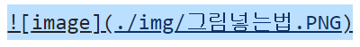
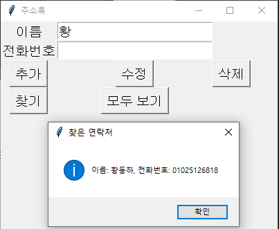

# juso206
주소록 프로그램 연습 
2024년 10월 07일 206호 강의실에서 하다가 201 강의실로 옮긴 기념으로 만듬

###그림 넣는 방법 

위 와 같이 띠어쓰기 없이 그림의 위치를 입력합니다. 

주의 사항 : 대소문자 구별 

## chatGPT를 이용한 코딩 

chatGPT 4omini를 로그인 하지 않고 사용함. 

1번째 질문 : 안녕 너는 파이썬 전문가라면서 나 지금 부터 GUI로 만든 주소록을 만들려고 해 
내용은 이름과 전화번호를 입력 수정 삭제 찾기 할수 있게 해주고 
이것을 csv 형식으로 파일에 저장하고 싶어 코드를 만들어줘 

결과가 맘에 안들어서 

2번째 질문 : 야 무슨 프로그램이 아마그램이냐 저장한 csv가 김,0
동,1
하,0
김,1
동,2
하,3 ㅇ이렇게 나오고 뭐 입력창도 엉망이고 또 전체보기가 안되고 실망이다. 다시해라 

3번째 질문 : 다이얼로그가 작다 크게 하고 글씨도 크게 해줘

4번째 질문 : 찾기에서 황동하를 다 입력 하지 않고 황 만 입력했을때 황이 포함된것을 찾아줘 

